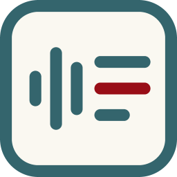
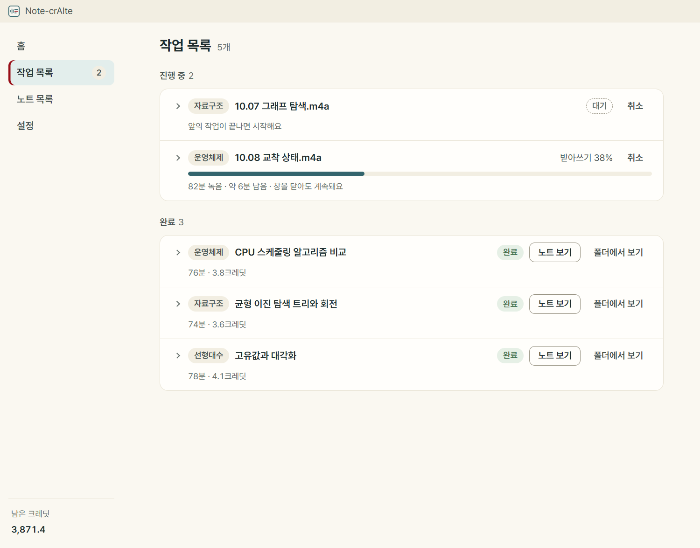
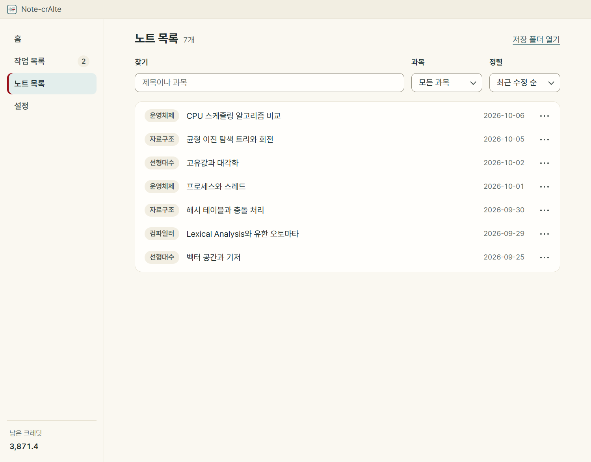

<div align="center">



# Note-crAIte

**강의 녹음을 노트로.**

녹음 파일을 끌어 놓으면 요약, 주요 키워드, 전사문이 담긴 마크다운 노트가 과목 폴더에 저장되는 데스크톱 앱입니다.

[](https://github.com/jeongho30/Note-crAIte/actions/workflows/check.yml)


[](LICENSE)

[주요 기능](#주요-기능) · [화면](#화면) · [설치](#설치) · [크레딧과 속도](#크레딧과-속도) · [소스에서 실행](#소스에서-실행) · [소개 페이지](https://claude.ai/artifact/GRgkqguRfzixiHgLh1PZ7j)

<picture>
  <source media="(prefers-color-scheme: dark)" srcset="docs/images/home-dark.png">
  
</picture>

</div>

받아쓰기는 내 컴퓨터에서 하고 요약만 AI 서비스에 맡깁니다. 그래서 녹음 파일은 컴퓨터 밖으로 나가지 않고, ChatKHU 기준으로 90분 강의 한 개에 약 4크레딧이 듭니다. 읽는 법은 "노트크리에이트"이고, ChatKHU 공모전 출품작입니다.

> 이 문서의 화면은 실제 앱을 찍은 것이고, 안에 보이는 노트·작업·크레딧 잔액은 보여 주려고 만든 예시입니다.

## 주요 기능

- **녹음에서 노트까지 한 번에**: 파일을 끌어 놓거나 고르면 받아쓰기, 정리, 요약, 저장까지 이어서 합니다. 시작하기 전에 걸릴 시간과 들 크레딧을 먼저 보여 줍니다.
- **내 컴퓨터에서 받아쓰기**: [whisper.cpp](https://github.com/ggml-org/whisper.cpp)로 받아씁니다. 첫 실행 때 프로세서와 그래픽카드를 각각 재 보고, 더 빠르면서 결과가 정상인 쪽을 고릅니다.
- **요약 서비스를 골라 연결**: ChatKHU, OpenAI, Claude, Gemini 중 하나를 API 키로 연결합니다. 키가 없으면 전사문만 담은 노트를 만듭니다.
- **로컬 LLM**: 요약과 전사문 다듬기를 [Ollama](https://ollama.com)로 돌릴 수 있습니다. 이때는 강의 내용이 컴퓨터 밖으로 전혀 나가지 않습니다.
- **필기 참고**: 녹음과 같은 이름의 필기(.md, .txt)를 함께 넣으면 잘못 받아쓴 용어를 고칠 때 참고합니다.
- **앱에서 바로 녹음**: 마이크나 컴퓨터 소리(온라인 강의, Windows만)를 녹음해 그대로 노트로 만듭니다.
- **자동 처리**: 폴더를 정해 두면 새로 들어온 녹음을 알아서 노트로 만듭니다. 창을 닫아도 트레이에서 계속 돕니다.
- **멈춘 곳부터 이어서**: 단계마다 결과를 남겨서, 실패하거나 앱이 꺼져도 끝난 단계는 다시 하지 않습니다.
- **평범한 마크다운**: 노트는 `.md` 파일 하나라 옵시디언이나 다른 편집기에서 그대로 열립니다. 수식은 LaTeX로 적습니다.
- **노트 다루기**: 앱 안에서 미리 보고, 제목·과목·날짜를 고치고, 요약만 다시 만들 수 있습니다. 요약 프롬프트에 내 지시를 덧붙일 수도 있습니다.
- **라이트·다크 화면**: OS 설정을 따르거나 직접 고릅니다.

## 화면

| 시작 전 확인 | 작업 목록 |
|---|---|
|  |  |
| 녹음을 과목 칸으로 끌어 나누고, 걸릴 시간과 크레딧을 확인합니다. | 한 번에 하나씩 처리하고, 창을 닫아도 계속됩니다. |

| 노트 미리보기 | 노트 목록 |
|---|---|
| <picture><source media="(prefers-color-scheme: dark)" srcset="docs/images/preview-dark.png"></picture> |  |
| 개요와, 주제마다 "개념: 한 줄"로 된 요약을 봅니다. | 제목이나 과목으로 찾고, 수정하거나 삭제합니다. |

## 쓰는 법

1. **녹음을 넣습니다.** 파일을 끌어 놓거나 고르고, 앱에서 바로 녹음해도 됩니다.
2. **과목을 고르고 시작합니다.** 여러 개를 한꺼번에 넣고 과목별로 나눌 수 있습니다.
3. **다른 일을 하다 보면 노트가 생깁니다.** 처리는 뒤에서 돌고, 끝나면 알려 줍니다.

### 노트에 담기는 것

`<저장 폴더>/<과목>/<날짜> <제목>.md` 한 파일입니다.

| 부분 | 내용 |
|---|---|
| 요약 | 강의 전체 개요와, 주제마다 "개념: 한 줄" 목록 |
| 주요 키워드 | 5~10개 |
| 전사문 | 반복과 환각 문장을 지우고 잘못 받아쓴 용어를 고친 글 (접혀 있음) |
| 원문 정리본 | 고치기 전 글과 문단마다의 시각 (접혀 있음) |
| 교정 내역 | 무엇을 무엇으로 몇 번 바꿨는지 (접혀 있음) |


## 설치

| OS | 상태 |
|---|---|
| Windows 64비트 | 지원 |
| macOS 13 이상, Apple Silicon | 베타. GitHub의 macOS 러너에서 빌드하고 앱을 띄워 노트를 만드는 데까지 확인했고, 실제 Mac에서는 아직 써 보지 못했습니다. |

설치 파일은 이 저장소의 GitHub Actions([installer.yml](.github/workflows/installer.yml))가 소스에서 만듭니다. Release로 올리는 공개 배포는 준비 중이라, 지금은 [소스에서 실행](#소스에서-실행)할 수 있습니다.

처음 켜면 마법사가 받아쓰기 모델(875MB)을 받고, 요약 서비스의 API 키와 노트를 저장할 폴더를 묻습니다.

<details>
<summary><b>Windows: "Windows의 PC 보호" 창이 뜰 때</b></summary>

설치 파일에 아직 코드 서명이 없어서 Windows가 파란 창으로 막습니다. 파일이 손상됐거나 위험하다는 뜻이 아니라, 게시자를 확인할 서명이 없고 받아 본 사람이 적은 파일에 뜨는 경고입니다.

1. 창에서 **추가 정보**를 누릅니다.
2. 앱 이름이 Note-crAIte 설치 파일인지 확인하고 **실행**을 누릅니다.

브라우저가 내려받을 때 "일반적으로 다운로드되지 않는 파일"이라고 막으면 **유지**를 고릅니다. 설치는 관리자 권한 없이 현재 사용자 계정에만 됩니다. 설치 파일은 이 저장소의 GitHub Actions가 만든 것만 받으세요.

</details>

<details>
<summary><b>macOS: 처음 열 때 막힐 때</b></summary>

DMG에 Apple 개발자 서명과 공증이 없습니다(임시 서명). 앱을 응용 프로그램 폴더로 옮긴 뒤 처음 열면 macOS가 막습니다.

1. 한 번 열어 경고 창을 닫습니다.
2. **시스템 설정 > 개인정보 보호 및 보안**의 아래쪽에서 Note-crAIte 옆 **그래도 열기**를 누릅니다.

macOS에서는 컴퓨터 소리 녹음이 되지 않습니다. 마이크 녹음과 파일로 넣기는 같습니다.

</details>

## 크레딧과 속도

### 크레딧 (ChatKHU)

ChatKHU 학생 크레딧은 한 달 4,000입니다. 90분 강의 한 개 기준으로:

| 방법 | 크레딧 | 한 달에 만들 수 있는 노트 |
|---|---|---|
| ChatKHU로 받아쓰기 + 요약 | 약 544 | 약 7개 |
| 내 PC 받아쓰기 + 전사문 다듬기 + 요약 | 약 34 | 약 118개 |
| **내 PC 받아쓰기 + 요약 (기본)** | **약 3.9** | **약 1,000개** |

받아쓰기 단가(1분에 6크레딧)는 ChatKHU 문서의 값이고, 요약과 다듬기는 gpt-6-luna로 강의 4개를 돌려 90분으로 환산한 값입니다. OpenAI·Claude·Gemini를 연결하면 크레딧 대신 작업마다 쓴 토큰 수를 보여 줍니다.

### 받아쓰기 속도

| PC | 녹음 | 받아쓰기 |
|---|---|---|
| 노트북 (Ryzen 7 5700U, 프로세서로 처리) | 82분 강의 | 29분 42초 |
| 데스크톱 (Radeon RX 9070 XT) | 10분 구간 | 8.5초 |

노트북 값은 CI가 만든 설치 파일로 강의 하나를 끝까지 처리한 결과이고, 요약까지 합친 전체 시간은 31분 58초였습니다. 노트북 한 대, 강의 하나로 잰 값입니다.

## 소스에서 실행

**Windows**: Node 24 이상, PATH의 ffmpeg, whisper.cpp를 빌드할 도구(Visual Studio C++, CMake, Vulkan SDK)가 필요합니다. 빌드 스크립트가 고정한 커밋의 소스를 직접 받고, `-NoVulkan`을 붙이면 Vulkan 없이 빌드합니다.

```bash
git clone https://github.com/jeongho30/Note-crAIte
cd Note-crAIte
powershell -File scripts/build_whisper.ps1
cd app
npm ci
npm run dev
```

**macOS**: Node 24 이상, Xcode 명령줄 도구, CMake, pkg-config가 필요합니다. whisper는 Metal로, ffmpeg는 앱이 쓰는 기능만 넣어 LGPL로 빌드합니다.

```bash
git clone https://github.com/jeongho30/Note-crAIte
cd Note-crAIte
bash scripts/build_whisper.sh
bash scripts/build_ffmpeg.sh
export PATH="$PWD/.cache/ffmpeg/bin:$PATH"
cd app
npm ci
npm run dev
```

그 밖의 명령(모두 `app/`에서):

| 명령 | 하는 일 |
|---|---|
| `npm test` | 테스트 |
| `npm run typecheck` | 타입 검사 |
| `npm run cli -- run <녹음> --out <저장 폴더> --subject <과목>` | 화면 없이 노트 만들기 |
| `npm run dist:win` | Windows 설치 파일 (먼저 `scripts/fetch_ffmpeg.ps1`) |
| `npm run dist:mac` | macOS DMG (먼저 `scripts/build_whisper.sh`, `build_ffmpeg.sh`) |

## 구조

Electron과 TypeScript 하나로 만들었습니다. 무거운 계산은 함께 설치되는 whisper-cli와 ffmpeg가 하고, 앱은 그것들을 부르고 결과를 이어 붙입니다.

```
오디오 준비 → 받아쓰기 → 정리 → (다듬기) → 요약 → 노트 만들기 → 저장
   내 PC        내 PC     내 PC   └ 요약 서비스 또는 로컬 LLM ┘   내 PC       내 PC
```

| 폴더 | 내용 |
|---|---|
| `app/src/core/` | 처리 코드. Electron에 기대지 않아 앱, 명령줄 도구(`app/src/cli/`), 테스트(`app/test/`)가 같은 코드를 씁니다. |
| `app/src/main/` | 메인 프로세스. 화면이 부를 수 있는 처리를 허용 목록으로 열고, 작업을 한 번에 하나씩 돌립니다. |
| `app/src/renderer/` | 화면(React). 샌드박스 안에서 돕니다. |
| `scripts/` | whisper.cpp와 ffmpeg를 빌드하거나 받는 스크립트 |
| `docs/` | 결정과 실험 기록([decisions.md](docs/decisions.md)) |

## 개인정보

- 녹음 파일은 컴퓨터 밖으로 나가지 않습니다. 요약할 때 전사문, 필기, 과목 이름만 연결한 요약 서비스로 보냅니다. (실험 기능인 ChatKHU 받아쓰기를 직접 켰을 때만 녹음을 올립니다.)
- API 키는 OS의 암호화 저장소로 암호화해 두고, 화면에는 끝 네 자리만 보여 줍니다.
- 로그에는 작업 상태와 실패 이유만 남기고 키와 강의 내용은 적지 않습니다.
- 이 저장소에는 강의 녹음·전사·노트가 없습니다. 테스트는 합성 데이터만 씁니다.

## 재 보고 정한 것

기본값은 실제 강의 녹음으로 비교해 정했고, 과정과 수치는 [docs/decisions.md](docs/decisions.md)에 있습니다.

- **요약 모델 gpt-6-luna**: 16개 모델을 강의 4개로 비교했습니다. 90분 약 3크레딧으로 가장 싼 축인데, 요약 점수는 가장 비싼 모델과 같았고 사실과 다른 서술이 없었습니다.
- **받아쓰기 모델 large-v3-turbo**: 작성자가 10분 구간 여섯 개를 들으며 만든 정답으로 채점했습니다. 오류율 15.5%(전문용어 적중 73%)이고, 세 배 빠른 small은 24.7%(43%)라 기본으로 쓰지 않습니다.
- **전사문 다듬기는 선택 기능**: 켜면 오류율 14.2%, 전문용어 적중 93%가 되지만 90분에 약 30크레딧이 듭니다.
- **넣지 않은 것**: 오디오 전처리 필터, whisper 초기 프롬프트, 빔 서치, 필기 용어로 코드가 직접 고치기. 효과가 없거나 나빠졌습니다.

## 아직 못 한 것

- OpenAI·Claude·Gemini 연결은 가짜 응답 테스트만 통과했고, 실제 키로는 불러 보지 못했습니다. 로컬 LLM(Ollama)은 실제 강의 길이의 요약을 아직 돌려 보지 못했습니다.
- 요약 비교는 강의 4개, 정답 전사는 10분 구간 6개입니다. 요약 채점은 Claude가 했고 작성자가 일부만 검수했습니다.
- 개발자가 아닌 사람이 설치부터 첫 노트까지 가는 테스트는 아직 하지 않았습니다. 설치 파일에 서명이 없어 OS가 경고를 띄웁니다([넘어가는 법](#설치)).
- Mac은 실제 기기에서 확인하지 못했습니다. GitHub의 macOS 러너(가상 머신)에서 빌드·테스트하고 앱을 띄워 첫 실행 마법사부터 노트 미리보기까지 자동으로 눌러 본 것이 전부입니다. 가상 머신에서는 그래픽 가속(Metal)이 프로세서보다 느려서, 실제 Mac에서의 받아쓰기 속도는 모릅니다. 마이크 녹음, 로그인할 때 자동 실행, 알림도 실제 Mac에서 봐야 합니다.

## 라이선스

[MIT](LICENSE). 설치본에 함께 들어가는 whisper.cpp(MIT), FFmpeg(LGPL 빌드), Pretendard(OFL) 등의 고지는 앱의 설정 > 정보에서 볼 수 있습니다.
