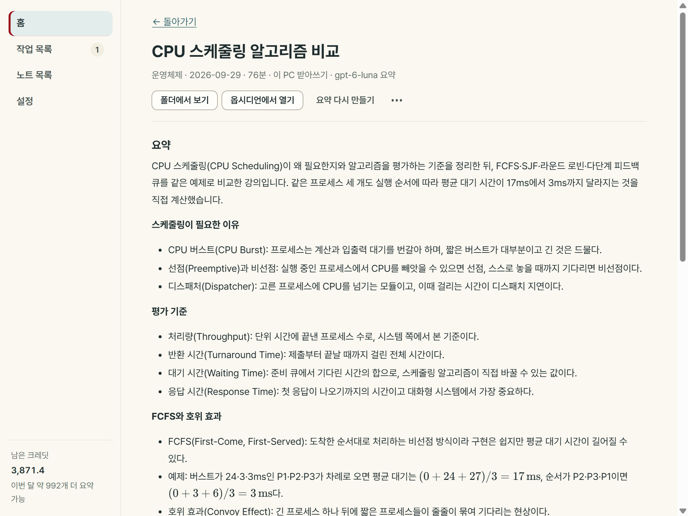
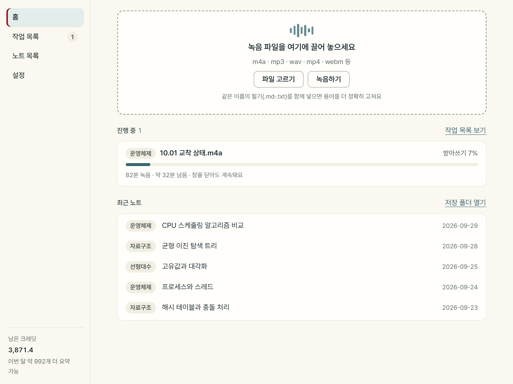
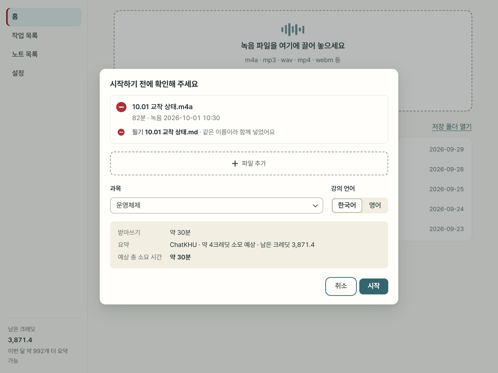
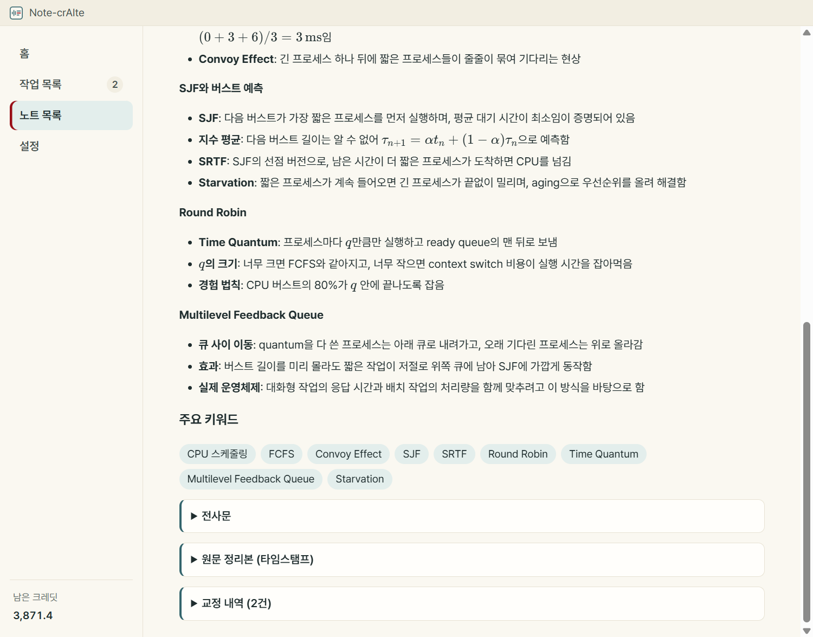

# Note-crAIte

**강의 녹음을 노트로.** 녹음 파일을 끌어 놓으면 요약, 주요 키워드, 전사문이 담긴 마크다운 노트가 과목 폴더에 저장되는 Windows 앱입니다. 받아쓰기는 내 PC에서 하고 요약만 ChatKHU에 맡겨서, 90분 강의 한 개에 약 4크레딧이 듭니다.

읽는 법은 "노트크리에이트"이고, ChatKHU 공모전 출품작입니다. 화면과 측정 결과를 한 장에 모은 [소개 페이지](https://claude.ai/artifact/GRgkqguRfzixiHgLh1PZ7j)가 있습니다.



화면은 실제 앱을 찍은 것이고, 안에 보이는 노트·작업 기록·크레딧 잔액은 보여 주려고 만든 예시입니다.

## 쓰는 법

1. **녹음을 넣습니다.** 파일을 끌어 놓거나 고릅니다. 앱에서 마이크나 컴퓨터 소리를 바로 녹음할 수도 있습니다. 같은 이름의 필기(.md, .txt)를 함께 넣으면 용어를 고칠 때 참고합니다.
2. **과목을 고르고 시작합니다.** 시작하기 전에 받아쓰기에 걸릴 시간과 요약에 들 크레딧을 먼저 보여 줍니다.
3. **다른 일을 하다 보면 노트가 생깁니다.** 처리는 뒤에서 돌고 창을 닫아도 계속됩니다. 앱이 꺼져도 다음에 켜면 멈춘 곳부터 이어서 합니다.

| 홈 | 시작 전 확인 |
|---|---|
|  |  |

## 노트에 담기는 것

`<저장 폴더>/<과목>/<날짜> <제목>.md` 한 파일입니다. 평범한 마크다운이라 옵시디언이나 다른 편집기에서 그대로 열립니다.

- **요약**: 강의 전체 개요와, 주제마다 "개념: 한 줄" 목록
- **주요 키워드**: 5~10개
- **전사문**: 반복과 환각 문장을 지우고 잘못 받아쓴 용어를 고친 글 (접혀 있음)
- **원문 정리본**: 고치기 전 글과 문단마다의 시각 (접혀 있음)
- **교정 내역**: 무엇을 무엇으로 몇 번 바꿨는지 (접혀 있음)



## 크레딧

ChatKHU 학생 크레딧은 한 달 4,000입니다. 90분 강의 한 개 기준으로:

| 방법 | 크레딧 | 한 달에 만들 수 있는 노트 |
|---|---|---|
| ChatKHU로 받아쓰기 + 요약 | 약 544 | 약 7개 |
| 내 PC 받아쓰기 + 전사문 다듬기 + 요약 | 약 34 | 약 118개 |
| 내 PC 받아쓰기 + 요약 (기본) | 약 3.9 | 약 1,000개 |

받아쓰기 단가(1분에 6크레딧)는 ChatKHU 문서의 값이고, 요약과 다듬기는 gpt-6-luna로 강의 4개를 돌려 90분으로 환산한 값입니다.

## 속도

첫 실행 때 짧은 샘플을 프로세서와 그래픽카드로 각각 받아써 보고, 더 빠르면서 결과가 정상인 쪽을 고릅니다.

| PC | 녹음 | 받아쓰기 |
|---|---|---|
| 노트북 (Ryzen 7 5700U, 프로세서로 처리) | 82분 강의 | 29분 42초 |
| 데스크톱 (Radeon RX 9070 XT) | 10분 구간 | 8.5초 |

노트북 값은 CI가 만든 설치 파일로 강의 하나를 끝까지 처리한 결과이고, 요약까지 합친 전체 시간은 31분 58초였습니다. 노트북 한 대, 강의 하나로 잰 값입니다.

## 실행

Windows 64비트용입니다. 설치 파일은 GitHub Actions(`.github/workflows/installer.yml`)가 만들고, 공개 배포는 준비 중입니다. 지금은 소스에서 실행할 수 있습니다.

필요한 것: Node 24 이상, PATH의 ffmpeg, [whisper.cpp](https://github.com/ggml-org/whisper.cpp)를 빌드할 도구(Visual Studio C++, CMake, Vulkan SDK). 빌드 스크립트가 고정한 커밋의 소스를 직접 받고, `-NoVulkan`을 붙이면 Vulkan 없이 빌드합니다.

```bash
git clone https://github.com/jeongho30/Note-crAIte
cd Note-crAIte
powershell -File scripts/build_whisper.ps1
cd app
npm ci
npm run dev
```

처음 켜면 마법사가 받아쓰기 모델(875MB)을 받고, ChatKHU API 키와 노트를 저장할 폴더를 묻습니다. 키가 없으면 전사문만 담은 노트를 만듭니다.

그 밖의 명령(모두 `app/`에서):

```bash
npm test                 # 테스트
npm run typecheck        # 타입 검사
npm run cli -- run <녹음> --out <저장 폴더> --subject <과목>   # 화면 없이 노트 만들기
npm run dist:win         # 설치 파일 (먼저 scripts/fetch_ffmpeg.ps1)
```

## 구조

Electron과 TypeScript 하나로 만들었습니다. 무거운 계산은 함께 설치되는 whisper-cli와 ffmpeg가 하고, 앱은 그것들을 부르고 결과를 이어 붙입니다.

```
오디오 준비 → 받아쓰기 → 정리 → (다듬기) → 요약 → 노트 만들기 → 저장
   내 PC        내 PC     내 PC    ChatKHU    ChatKHU     내 PC       내 PC
```

- `app/src/core/`: 처리 코드. Electron에 기대지 않아 앱, 명령줄 도구(`app/src/cli/`), 테스트(`app/test/`)가 같은 코드를 씁니다.
- `app/src/main/`: 메인 프로세스. 화면이 부를 수 있는 처리를 허용 목록으로 열고, 작업을 한 번에 하나씩 돌립니다.
- `app/src/renderer/`: 화면(React). 샌드박스 안에서 돕니다.
- 단계마다 결과 파일을 남겨서, 실패하거나 앱이 꺼져도 끝난 단계는 다시 하지 않습니다.
- 요약과 전사문 다듬기는 ChatKHU 대신 로컬 LLM(Ollama)으로도 돌릴 수 있습니다.

## 개인정보

- 녹음 파일은 PC 밖으로 나가지 않습니다. 요약할 때 전사문, 필기, 과목 이름만 보냅니다.
- API 키는 Windows의 암호화 저장소로 암호화해 두고, 화면에는 끝 네 자리만 보여 줍니다.
- 로그에는 작업 상태와 실패 이유만 남기고 키와 강의 내용은 적지 않습니다.
- 이 저장소에는 강의 녹음·전사·노트가 없습니다. 테스트는 합성 데이터만 씁니다.

## 재 보고 정한 것

기본값은 실제 강의 녹음으로 비교해 정했고, 과정과 수치는 [docs/decisions.md](docs/decisions.md)에 있습니다.

- **요약 모델 gpt-6-luna**: 16개 모델을 강의 4개로 비교했습니다. 90분 약 3크레딧으로 가장 싼 축인데, 요약 점수는 가장 비싼 모델과 같았고 사실과 다른 서술이 없었습니다.
- **받아쓰기 모델 large-v3-turbo**: 작성자가 10분 구간 여섯 개를 들으며 만든 정답으로 채점했습니다. 오류율 15.5%(전문용어 적중 73%)이고, 세 배 빠른 small은 24.7%(43%)라 기본으로 쓰지 않습니다.
- **전사문 다듬기는 선택 기능**: 켜면 오류율 14.2%, 전문용어 적중 93%가 되지만 90분에 약 30크레딧이 듭니다.
- **넣지 않은 것**: 오디오 전처리 필터, whisper 초기 프롬프트, 빔 서치, 필기 용어로 코드가 직접 고치기. 효과가 없거나 나빠졌습니다.

## 아직 못 한 것

- 요약 비교는 강의 4개, 정답 전사는 10분 구간 6개입니다. 요약 채점은 Claude가 했고 작성자가 일부만 검수했습니다.
- 개발자가 아닌 사람이 설치부터 첫 노트까지 가는 테스트는 아직 하지 않았습니다. 설치 파일에 서명이 없어 Windows가 경고를 띄웁니다.
- Mac은 베타를 계획하고 있습니다.

## 라이선스

[MIT](LICENSE). 설치본에 함께 들어가는 whisper.cpp(MIT), FFmpeg(LGPL 빌드), Pretendard(OFL) 등의 고지는 앱의 설정 > 정보에서 볼 수 있습니다.
